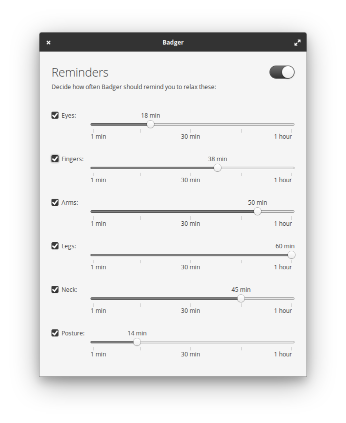

<h1 align="center">Badger</h1>
<p align="center">Remind yourself to not sit and stare at the screen for too long</p>

<p align="center">
    
</p>


## Badgers you to be ergonomic

Badger will periodically send notifications to remind you to relax your eyes,
stretch your fingers, and turn your neck among other things. It helps you keep
your muscles free and your eyes unstrained.


## Built for elementary OS

While Badger will happily compile on any Linux distribution, it is primarily
built for [elementary OS].


## Developing and building

Development is targeted at [elementary OS] Juno. If you want to hack on and
build Badger yourself, you'll need the following dependencies:

* libgranite-dev
* libgtk-3-dev
* meson
* valac

You can install them on elementary OS Juno with:

```shell
sudo apt install elementary-sdk
```

Run `meson build` to configure the build environment and run `ninja install`
to install:

```shell
meson build --prefix=/usr
cd build
sudo ninja install
```

Then run it with:

```shell
com.github.elfenware.badger
```

[elementary OS]: https://elementary.io
